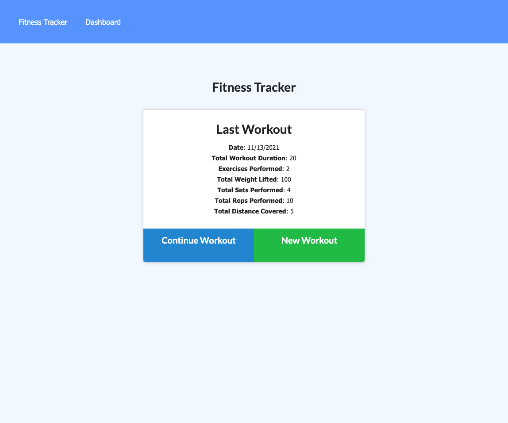

# NOSQL_FITNESS_TRACKER

## Description: 
 The purpose of this application was to create a fitness tracker using mongoDB (NoSQL). Users are presented with the ability to:
    - Create a Workout ( Resistance or Cardio )
    - Create Exercises ( Weight, Distance, Time, Sets/Reps, Name)
    - Presented with a sum total of their performace, distance, weights and time

## Table of Contents 

* [Installation](#installation)
* [Usage](#usage)
* [Contributors](#contributors)
* [License](#license)
  
## Installation 
This application is currently being ran on Heroko. 
https://cab-workout-tracker.herokuapp.com/
## ScreenShot 
 

## Contributors 

TA , AskBCS , Study Group

## Testing 
No Testing included for this project.

## License 
MIT 

## Questions: 
If you have any questions, please feel free to contact me at:
  Email Address: christa.baccas@gmail.com
  Github Account: https://github.com/christa-baccas
